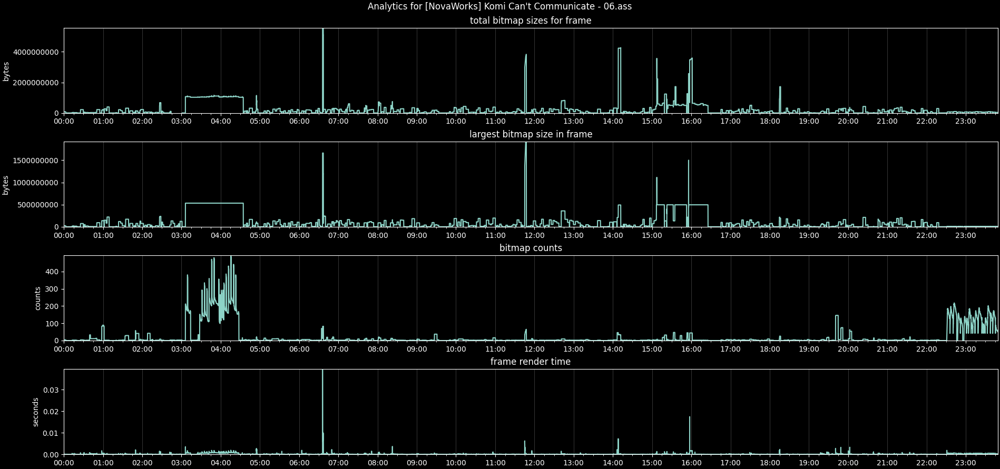

# Assytics
### purpose
This project seeks to profile the performance of your `.ass` subtitle file. This is intended for fansub groups that make heavy use of masking and typesetting (or other visual tricks) in order to provide a much more immersive viewing experience.



### prerequisites
1. gcc compiler
2. libass
3. python3
  * matplotlib

Do note that this code has only been tested on Arch Linux

### compiling
Run this to build libass_profiler
```bash
$ gcc libass_profiler.c -o libass_profiler -I/path/to/libass/ -lass
```

### usage
Run this command to gather performance data
```bash
$ ./libass_profiler /path/to/your/subtitle_file.ass
```
This should generate a csv file called `output.csv`

Run
```bash
$ python graph_statistics_csv.py -i output.csv
```
