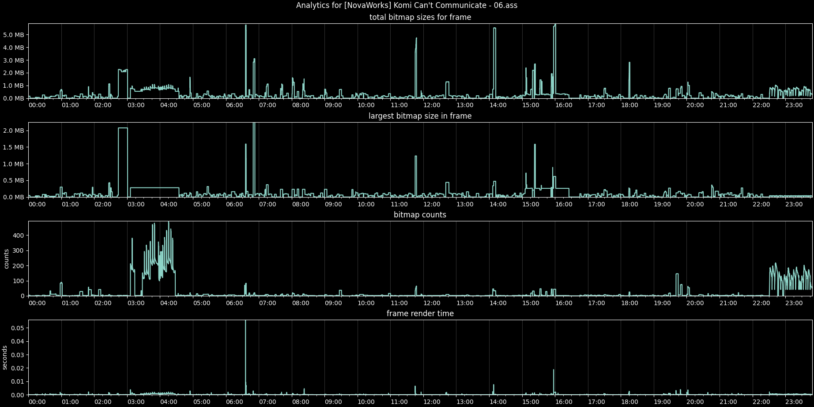

# Assytics
### purpose
This project seeks to profile the performance of your `.ass` subtitle file. This is intended for fansub groups that make heavy use of masking and typesetting (or other visual tricks) in order to provide a much more immersive viewing experience.



### prerequisites
1. gcc compiler
2. libass (library and headers)
3. python3
    * matplotlib (pip package)

### compiling
On Arch Linux the command to build libass_profiler will look like this
```bash
$ gcc libass_profiler.c -o libass_profiler -lass
```

### usage
Run this command to gather performance data
```bash
$ ./libass_profiler /path/to/your/subtitle_file.ass
```
This should generate a csv file called `output.csv`

Run this to get a pretty looking graph similar to what you see above
```bash
$ python graph_statistics_csv.py -i output.csv
```
